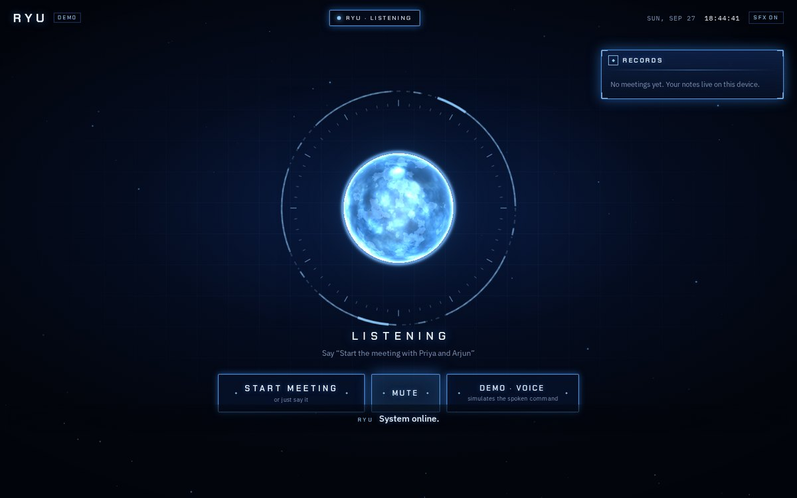
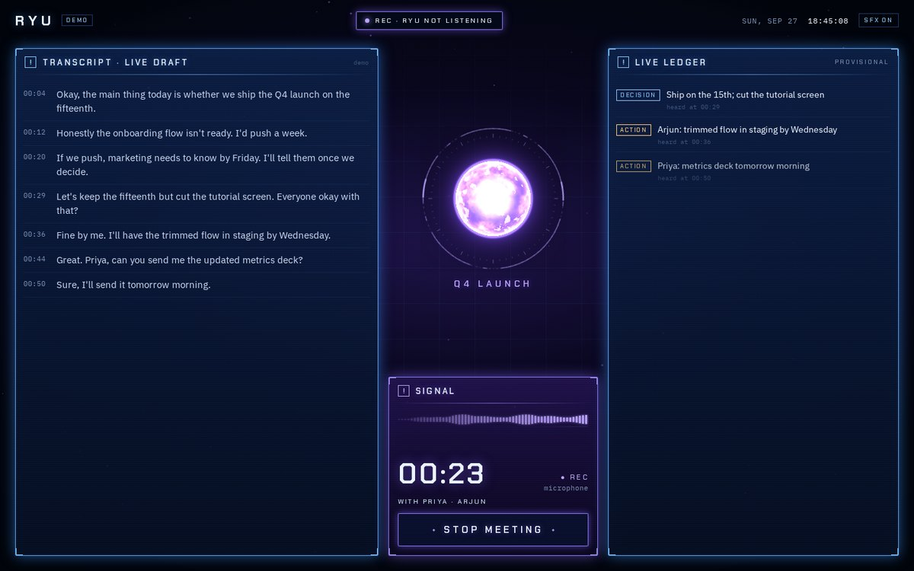
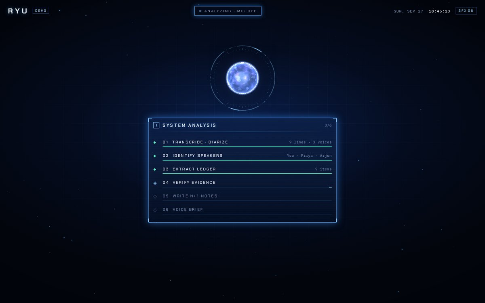
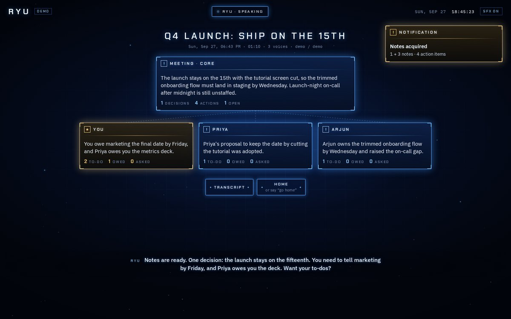
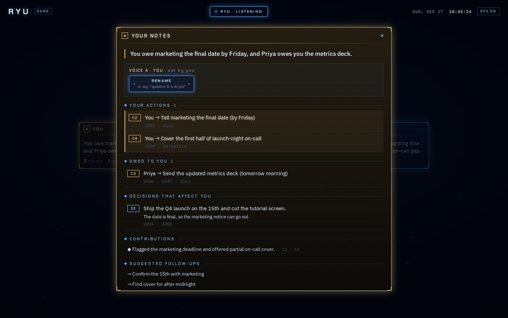

# RYU

**Voice-first meeting intelligence.** Open it and it's listening. Say *"start the meeting with Priya and Arjun"* and a holographic HUD boots around a recording core. Stop, and Ryu turns the recording into **n + 1 notes**: one shared meeting note, plus a personal note for every participant (your to-dos, what others owe you, the questions waiting on you).



| Meeting HUD | Analysis | n + 1 notes | Your note |
|---|---|---|---|
|  |  |  |  |

---

> Requires **Node 22.12+** (the scripts use Node's built-in `.env` loading).

## Try it in 60 seconds (no keys)

```bash
npm install
npm run dev:demo          # then open http://localhost:8081/?demo
```

Demo mode drives the **real UI** with a scripted meeting: boot → voice command → live HUD → pipeline → n+1 notes → spoken brief. Nothing leaves your machine.

## Run it for real (≈5 minutes)

**1. Keys.** Copy `.env.example` → `.env` and fill in:

| Key | Needed for | Free? |
|---|---|---|
| `GOOGLE_API_KEY` | brain (notes), voice (Gemini Live), fallback transcription | Yes: [aistudio.google.com/apikey](https://aistudio.google.com/apikey) |
| `LIVEKIT_URL` / `_API_KEY` / `_API_SECRET` | the voice link | Yes: local server (below) or [LiveKit Cloud](https://cloud.livekit.io) free plan |
| `GROQ_API_KEY` *(optional)* | faster live draft transcript | Yes, ~8 h audio/day |
| `ASSEMBLYAI_API_KEY` *(optional)* | best final transcript + speaker labels | $50 credit ≈ 200 h |

With **only Google + LiveKit**, everything works. Each optional key upgrades one slot ([Research 02 §5](docs/research/02-models-and-components.md)).

**2. LiveKit** (pick one):
- **Local:** `brew install livekit` (or grab a binary from GitHub releases), then `livekit-server --dev`. The `.env.example` defaults (`devkey` / `secret`) already match. **Use v1.12 or newer**: older servers reject the agent-dispatch tokens.
- **Windows:** download `livekit_<version>_windows_amd64.zip` from https://github.com/livekit/livekit/releases, unzip, run `.\livekit-server.exe --dev`, and **allow** the Windows Firewall prompt (UDP 7882 carries the audio). Start it *before* `npm run dev`; if the `[agent]` pane errors, fix and rerun.
- **Docker:** `docker run --rm -p 7880:7880 -p 7881:7881 -p 7882:7882/udp livekit/livekit-server:latest --dev --bind 0.0.0.0`
- **Cloud:** create a free project and paste its URL/key/secret.

**3. Go.**

```bash
npm run doctor   # checks every key and pings every provider
npm run dev      # server :8787 + voice agent + web app :8081
```

Open **http://localhost:8081**, press **Enter** (browsers need one click before audio can play), and talk.

### Voice commands (V1)

| Say | Does |
|---|---|
| "Start the meeting (with Priya and Arjun) (about the launch)" | Closes the voice session and starts recording. Names help speaker identification |
| "Open my notes" / "show Priya's notes" / "show the summary" | Opens that note |
| "Read my to-dos" / "read the decisions" | Ryu reads it aloud |
| "Speaker B is Arjun" / "the first speaker is me" | Fixes speaker names |
| "Go home" | Closes what's open |

Every command has a button twin. **Stop meeting** is a button in V1: no voice session runs during a meeting, by design ("Ryu not listening" is literally true).

Online meetings (Meet/Zoom in a browser tab): press **+ Tab audio** during a meeting and share the tab *with audio*.

## How it works

```
 APP (Expo: web / iOS / Android) ─ owns all data (IndexedDB / SQLite + audio files)
   │  Converse ── WebRTC ──► LiveKit ◄── Ryu agent (Gemini Live) ── tools ──► RPC back into the app
   │  Capture  ── 30 s WAV chunks ──► /api/stt/chunk   (live draft, Groq/Gemini)
   │           ── every ~90 s ─────► /api/live-ledger  (provisional decisions/actions)
   └  Stop     ── full recording ──► /api/process ──► NDJSON stream of stages + notes
                                        │
        SERVER (stateless — stores nothing)  transcribe+diarize → identify speakers → LEDGER
                                             → VERIFY → meeting note → n person notes (parallel) → voice brief
```

The design choices behind this live in [`docs/research`](docs/research):
- [01 — stack](docs/research/01-voice-stack.md)
- [02 — models](docs/research/02-models-and-components.md)
- [03 — data & speakers](docs/research/03-brain-and-data.md)
- [04 — experience & intelligence](docs/research/04-experience-and-intelligence.md)

**Why the notes are trustworthy.** The model extracts a **ledger** of typed items, and every item must cite the transcript lines it came from. A second, skeptical pass checks each one. Notes never restate facts: they reference ledger IDs, and the UI renders the ledger's own text. Code enforces what a prompt can't guarantee:
- Items citing lines that don't exist are dropped.
- No action item can go missing from the meeting note.
- "Your actions", "owed to you" and "questions for you" are *computed* from the ledger, not written by the model.

The whole pipeline runs in a test against a deliberately misbehaving mock model (`apps/server/src/pipeline/run.test.ts`).

## Project layout

```
apps/app        Expo SDK 57 app — src/{screens,ui,lib,state}; System design language in src/theme.ts + src/ui
apps/server     src/app.ts (API) · src/pipeline/ (prompts, schemas, run) · src/agent.ts (voice) · src/doctor.ts
packages/core   shared types, note rendering, demo fixture
docs/research   the why · docs/design the look
video           Remotion feature video, cut from deterministic captures of demo mode (see video/README.md)
```

Commands: `npm run dev` · `npm run dev:demo` · `npm run doctor` · `npm run typecheck` · `npm test`

## What's verified, and what isn't yet

This V1 was built and tested in a sandbox with **no API keys**, then re-verified locally (Windows, Node 24) on 2026-09-28. Honest status:

| Area | Status |
|---|---|
| Typecheck (all 3 packages, web + native files) | ✅ passes |
| Unit/integration tests (pipeline guarantees, voice-target parsing, CORS, local meeting day) | ✅ 8 pass |
| Dependencies vs registry, `expo-doctor` | ✅ all at `latest` (Expo 57 = latest stable); doctor 21/21 |
| Model IDs vs providers' live docs (`gemini-3.8-live`, `gemini-flash-latest`, Groq `whisper-large-v3-turbo`) | ✅ exist as of 2026-09-28 |
| Web bundle + full demo flow in Chromium (desktop + phone widths) | ✅ no console errors |
| Real stack in Chromium: token → LiveKit 1.12 room → agent dispatch → agent→app RPC → recording with fake mic → chunk upload → `/api/process` → graceful failure + retry | ✅ verified; Google rejected the placeholder key, as expected |
| Gemini Live conversation, real transcription, real note quality | ⏳ needs your key: **nothing real has run yet** |
| iOS / Android builds | ⏳ written + typechecked, **not yet built**. Needs a dev build (`npx expo run:ios` / `run:android`), not Expo Go |

## V1 scope and known gaps

- **Speakers:** diarization, then names from context. When you name the others at start, the leftover voice is taken to be you. Tap-to-rename covers the rest. Voiceprints, and stereo mic/tab separation, are designed ([Research 03 §4](docs/research/03-brain-and-data.md)) but not in V1.
- **Storage:** whole-meeting documents on the device. The normalized schema, search and sync come later.
- **Long meetings without AssemblyAI:** Gemini caps an inline request at 20 MB *including* base64 encoding, so the raw ceiling is ~14.5 MB (≈1 h at the 32 kbps both web and native now record at). Gemini's speaker labels are also only reliable up to ~30 min per request. For longer meetings, or 3+ speakers, add `ASSEMBLYAI_API_KEY`.
- **A recording lives in memory until you press Stop (web).** Closing or reloading the tab mid-meeting loses it, and the browser now asks before leaving. Incremental persistence of recorder chunks is the proper fix and is not built yet.
- **The server only answers browser pages from this machine or your LAN** (it spends your keys). Set `RYU_CORS_ORIGIN` (comma-separated, or `*`) to change that. Native apps are unaffected.
- **Web storage:** the app asks the browser for persistent storage. Safari may still evict it after 7 days without a visit.
- **Phone:** create `apps/app/.env` with `EXPO_PUBLIC_RYU_SERVER_URL=http://<your-LAN-IP>:8787` (Expo reads env from the app folder).
